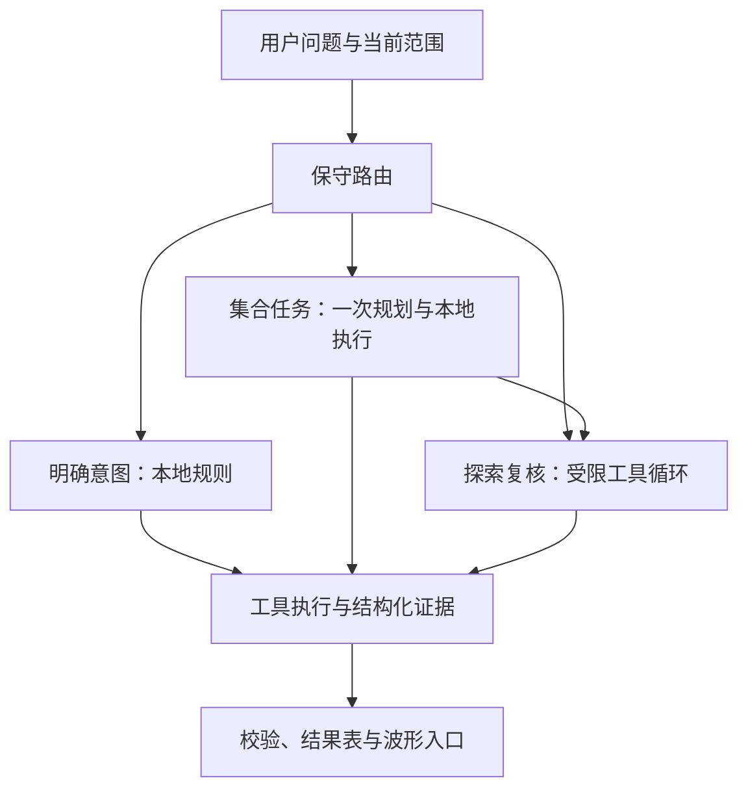

# ECG Evidence Review Agent

**基于 SGRF-Net 与本地信号工具的 ECG 证据复核工作区。** 面向模型研发与科研复盘，通过自然语言查询单条信号或样本集合，并把回答关联到可核对的数值、记录和波形。

专业模型负责信号分析，程序负责计算，LLM 负责理解问题、编排查询和解释证据。项目是研究原型，不提供临床诊断或治疗建议。

> 更新：2026-10-04。本文依据当前源码与已保存评测记录整理。自动验收、LLM 初评与人工确认是不同口径；当前没有人工确认的任务成功率。

## 解决什么问题

复核模型输出时，研究者往往需要反复选择样本、导联和时间窗口，查询统计值，再回到波形确认。本项目把这些操作串联起来，同时保留直接看图和固定筛选入口。

- **单条复核**：“查看 V2 最后 1.2 秒，给出起止点、均值和最大值”，再从证据入口定位同一窗口。
- **条件查询**：“比较 V1、V2 的窗口最大值，选较高导联，再向前扩展窗口复查。”
- **跨轮操作**：“保持刚才的结束位置，把起点向前扩 300 点。”历史对象用于恢复参数，数值仍通过本轮查询获得。
- **批次复核**：“找出异常分数最低的 5 条漏报记录”，或比较 FN 与 TP 的已有指标、有效样本数与缺失情况。

复杂任务仍可能失败。系统保留中间计算、错误阶段和调用成本，不把未通过校验的输出标为成功。

## 已实现的核心功能

| 能力 | 实现方式 |
|---|---|
| 本地 ECG 分析 | SGRF-Net 分数、重构及误差图；导联证据、候选区域；RR 与估计心率 |
| 波形复核 | 输入与重构叠加、误差展示、查询窗口高亮与记录入口 |
| 单样本工具问答 | 绑定 analysis_id 的窗口、RR、时间对齐等工具；受预算约束的迭代查询 |
| 多轮窗口记忆 | 保存导联与窗口对象；跨轮恢复后重新查询，避免把历史文字当作数值证据 |
| 批量本地分析 | 在用户操作后分析缺失记录，复用通过兼容性检查的历史结果 |
| 集合查询 | 筛选、排序、分页、聚合；LLM 生成结构化计划，本地执行计算 |
| 条件与跨记录复核 | 前一步结果绑定后一步参数；在所选批次内按需调用记录工具 |
| 证据约束 | 证据 ID、字段路径与值校验；对象范围、参数和调用预算限制 |
| 可观测性与恢复 | 分阶段 trace、请求耗时、有限修复；规划超时最多一次预算内恢复 |
| 历史与导出 | 本地 SQLite 保存分析与对话，支持查找、删除和导出 |

知识检索使用小规模 BM25 语料。相似病例检索、长期个人健康追踪及通用时序数据支持不属于当前已验收能力。

## 架构：按任务选执行方式



这是混合执行系统，而非所有问题都进入同一个 Agent 循环。

- **固定路径**处理已覆盖的明确查询与产品帮助，减少不必要的模型请求。
- **Plan-and-Execute 路径**把集合计划校验后交给程序计算；依赖统计结果的筛选值使用显式参数引用，缺失时停止依赖操作，不用 0 代替。
- **迭代工具路径**由模型根据返回结果继续查询或提交答案。单样本使用 LangGraph 组织运行图，属于受约束的 ReAct 式工具循环；批次解释也可按需补查。

LLM 不直接计算原始波形。深度推理主要发生在本地分析阶段，后续工具通常读取保存结果。波形入口由程序从证据中取出坐标生成，不允许模型随意生成记录跳转目标。

## 快速启动

### 1. 准备已有环境与本地资产

已观测环境包括 Windows、Python 3.10、PyTorch 2.6.0+cpu。`requirements-agent-observed.txt` 是早期观测依赖，**不是完整依赖锁，也尚未完成干净机器安装验证**。

真实样本分析需自行准备以下资产，源码仓库不包含数据、权重及个人运行历史：

| 资产 | 当前默认位置 |
|---|---|
| ECG 数组及标签 | `data/Processed_PTBXL/test.npy`、`label.npy` |
| SGRF-Net 权重 | `ckpt_shape_guided_shapex_gate/best_TSRNet_SHAPEXGate-epoch23-auc0.8871.pt` |
| 开发阈值配置 | `configs/anomaly_threshold.json` |
| 知识语料 | `data/knowledge/ecg_knowledge.jsonl` |

示例采用完整 12 导联、500 Hz，裁剪 `[100,4900)` 得到 4800 点、9.6 秒。窗口坐标默认相对输入片段，左闭右开；恢复原记录坐标需加裁剪起点。导联顺序为 I、II、III、aVR、aVL、aVF、V1–V6。

数据文件名相同不代表内容相同；版本匹配需检查数据、模型及处理配置。上传入口不能替代对训练预处理一致性的核验。

### 2. 启动本地网站

在项目根目录的 PowerShell 中执行：

```powershell
.\.venv-ecg\Scripts\python.exe scripts/check_agent_environment.py
.\.venv-ecg\Scripts\python.exe -m pip check
.\.venv-ecg\Scripts\python.exe -m streamlit run app_ecg.py --server.address 127.0.0.1 --server.port 8505 --browser.gatherUsageStats false
```

访问 [本地工作区](http://127.0.0.1:8505)。本地分析、波形和固定筛选不需要 LLM 密钥；需具备相应数据及权重。

### 3. 开启自然语言问答（可选）

在启动网站的同一终端先配置实际可用、支持工具调用的网关：

```powershell
$token = Read-Host "请输入网关 Token" -AsSecureString
$env:ECG_API_KEY = [System.Net.NetworkCredential]::new("", $token).Password
Remove-Variable token
$env:ECG_BASE_URL = Read-Host "请输入网关 Base URL"
$env:ECG_MODEL = Read-Host "请输入模型名称"
$env:LANGSMITH_TRACING = "false"
$env:LANGCHAIN_TRACING_V2 = "false"
```

然后执行上面的 Streamlit 启动命令，并在页面确认外发范围。`agent.env.example` 仅为示例，应用不会自动加载它。当前 `start_ecg_app.ps1` 仍绑定开发网关；公开使用时优先按本节显式配置。

## 建议的演示路线

1. **单样本**：打开已有分析，查看输入与重构叠加及误差图。
2. **查询与定位**：问“查看 V2 最后 1.2 秒，给出起止点、均值和最大值”，核对引用，再打开对应波形。
3. **多轮操作**：追问“结束位置不变，起点向前扩 300 点”，检查窗口对象是否一致。
4. **批次查询**：选择报告，问“找出所有漏报中异常分数最低的 5 条记录”，核对实际筛选排序条件。
5. **可观测性**：展示一次保存的失败与恢复记录，说明失败阶段、保留证据和额外请求成本。

FN 表示标签异常但模型预测正常；TP 表示标签异常且模型预测异常；FP 为误报，TN 为正确判为正常。没有标签时不能确定错分类型。分析尚未准备齐全时，应先完成批量本地分析，或明确报告缺失。

## 已有评测结果

### 跨记录 v3：可靠性收尾

| 指标 | 真实记录任务 | 合成边界任务 |
|---|---:|---:|
| 计划 / 已记录运行 | 14 / 14 | 7 / 7 |
| 无修复、恢复的首次自动通过 | 12/14（85.7%） | 7/7（100%） |
| 恢复后最终自动通过 | 14/14（100%） | 7/7（100%） |
| 目标字段正确数 | 64/64 | 15/15 |
| 模型请求总数，含失败与恢复 | 12 | 5 |
| 本地集合查询事件数 | 19 | 9 |
| 端到端中位耗时 | 8.25 秒 | 11.85 秒 |
| 运行耗时之和 | 379.88 秒 | 123.56 秒 |

真实题中有两次规划请求达到约 90 秒超时上限，经各一次预算内恢复完成。最终通过率提高不意味着没有超时或整体变快。部分题走本地路径，不需要模型请求。

**这些是小规模开发评测的自动验收结果，不是任意问题的成功率。** 验收检查目标字段、对象和查询合同及相应输出校验；不等于完整回答每句话都受证据支持，更不等于医学正确。边界题覆盖非空条件分支、真实缺失、同分排序等情况。该组也不是证明 Agent 优于规则的对照实验。

LLM 初评单独保存。当前初评的陈述提取范围仍需收紧，不能把“已提取陈述支持比例”当作全文支持率。详见 [评测口径与记录来源](docs/EVALUATION_RESULTS.md)。

### 固定任务三方案对照：规则并不落后

已有固定任务评测中，规则＋工具的目标字段覆盖率为 **90.9%**，Agent 为 **75.8%**。这支持保留简单任务的固定执行路径，而不是让所有请求都进入 Agent。

复杂条件任务的交互案例展示了动态参数传递的可行性，但尚不足以证明总体优势。当前重点是可核查的任务覆盖、成本与失败恢复。

### 底层 ECG 模型评测：单独报告

网站推理路径的 100 条开发记录：TN=47、FP=3、FN=16、TP=34，Accuracy=0.81、AUC=0.9032、Precision=0.9189、Recall=0.68、F1=0.7816。

这些衡量信号模型，不能作为 Agent 的成绩；也不是独立临床测试结果。阈值数据曾参与模型选择。

## 测试与评测入口

两组已在用户 Windows 环境通过的离线回归，可用于收尾检查：

```powershell
.\.venv-ecg\Scripts\python.exe -m unittest discover -s tests -p test_cross_record_v2.py -v
.\.venv-ecg\Scripts\python.exe -m unittest discover -s tests -p test_reliability_closeout.py -v
```

分别为 20 和 10 项工程测试，不计为 30 个真实 Agent 任务。全量测试中有依赖权重、数据或网关的项目，不应默认全部离线运行。

生成新的合成边界评测集（目标目录请使用未占用的路径）：

```powershell
.\.venv-ecg\Scripts\python.exe -m evaluation.cross_record_eval_v3 freeze-boundary --frozen evaluation/cross_record_frozen/boundary_demo
```

需要真实模型请求时，配置环境变量后显式执行：

```powershell
.\.venv-ecg\Scripts\python.exe -m evaluation.cross_record_eval_v3 run --frozen evaluation/cross_record_frozen/boundary_demo --allow-external
.\.venv-ecg\Scripts\python.exe -m evaluation.cross_record_eval_v3 report --frozen evaluation/cross_record_frozen/boundary_demo
```

报告生成在上述目录的 `report.html`。`judge` 为另外的 LLM 初评，会产生额外请求，不能与自动验收混为同一指标。真实批次冻结还需要对应报告与匹配历史；原始记录默认保留在本地，不随源码发布。

## 主要目录

| 路径 | 用途 |
|---|---|
| `app_ecg.py` | 统一分析与批次复核入口，8505 |
| `app_threeway_evaluation.py` | 三方案评测工作台入口，通常使用 8506 |
| `lib/`、`train.py` | 模型定义与训练代码 |
| `src/inference/`、`src/analysis/` | 推理适配、分析流程及历史 |
| `src/evidence/`、`src/features/`、`src/tools/` | 证据抽取、信号计算及工具执行 |
| `src/agent/` | 网关、运行图、记忆、答案校验 |
| `src/review/` | 集合查询、计划绑定、跨记录复核及恢复 |
| `src/knowledge/`、`data/knowledge/` | BM25 检索与小规模语料 |
| `src/ui/`、`src/reporting/` | 展示、波形联动与导出 |
| `evaluation/`、`tests/` | 评测脚本、题目与回归测试 |

根目录旧 `ui_ecg_*` 等脚本为历史或专用入口，默认从 `app_ecg.py` 启动。

## 已知限制

- 网站与 `test2.py` 曾因归一化路径不同产生不同分数。部署路径评测已使用网站适配器，但训练预处理一致性仍需核验；不要混用不同路径的分数与阈值。
- 模型分数不是概率，误差峰和导联排名不是病变定位。没有候选区域也不能排除疾病。
- 峰检测与真实测量准确性尚未充分验证；RR 标准差不等于经过窦性筛选的 SDNN。
- 数值与引用校验不覆盖所有自由文本推断；组间差异只能提供描述性线索，不能证明漏报原因。
- 超时、输出截断及错误计划仍可能出现；有限恢复不保证最终完成。
- 当前为本地单用户原型，缺少生产级多租户隔离、任务队列及服务保障。
- 依赖锁定、干净环境复现与完整代码授权梳理尚未完成。

## 更多说明与来源

- [使用指南](docs/user_guide.md)
- [本次评测口径与来源](docs/EVALUATION_RESULTS.md)
- [原始 SGRF-Net 说明](docs/SGRF_MODEL_ORIGINAL.md)：保留原始模型来源、实验与引用信息；其中成绩不与网站或 Agent 评测混用。
- `README_AGENT.md` 与部分阶段文档保留早期实现记录，其中批次能力、预算与评测描述可能过时；当前总览以本页为准，具体行为以源码与对应运行配置为准。

本仓库尚未确定整体开源许可证；公开分发前需核对原模型、第三方代码和数据的使用条件。
